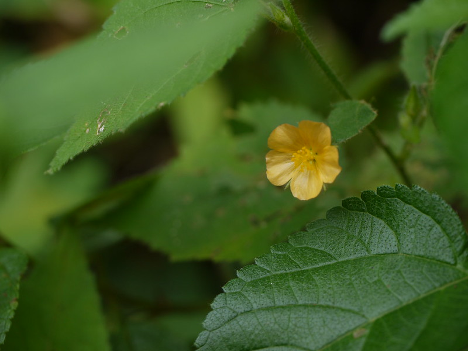

# Sida mysorensis - Mysore Fanpetals, Antututti

[TOC]

**Sida mysorensis** is a small herb, Erect. It can grow up to 1m tall.
## Uses
Wounds.

## Parts Used

## Chemical Composition

## Common names
| Language | Names |
| --- | --- |
| English | Mysore Fanpetals |
| Kannada | Antututti |

## Properties
Reference: Dravya - Substance, Rasa - Taste, Guna - Qualities, Veerya - Potency, Vipaka - Post-digesion effect, Karma - Pharmacological activity, Prabhava - Therepeutics.
### Dravya
### Rasa
### Guna
### Veerya
### Vipaka
### Karma
### Prabhava
## Habit
## Identification
### Leaf
Ovate, Heart, Base is heart shaped, Margin toothed, Tip long pointed

### Flower
1-1.2cm in daimeter, Yellow, Petals inverted triangular, Hairless. Flowering season is October to February

### Fruit
Fruiting season is October to February

### Other features
## List of Ayurvedic medicine in which the herb is used
## Where to get the saplings
## Mode of Propagation
## How to plant/cultivate

## Commonly seen growing in areas

## Photo Gallery

## References

## External Links
* [ ]
* [ ]
* [ ]

## References

1. [Chemistry]
2. Kappatagudda - A Repertoire of  Medicianal Plants of Gadag by Yashpal Kshirasagar and Sonal Vrishni, Page No. 340
3. [Cultivation]
4. **Daitota, P. S. Venkatarama. *Auṣadhīya Sasyagaḷu (ಔಷಧೀಯ ಸಸ್ಯಗಳು; Medicinal Plants)*. Vivekananda Samshodhana Kendra, Vivekananda Vidyavardhaka Sangha, Puttur, 2016, p. 65.**
   Medicinal uses as mentioned in Daitota's Auṣadhīya Sasyagaḷu: the plant is presented as a remedy for joint wear (sandhi-saveta). Leaves and root are used in a thin soup (sāru) for stiff, painful joints, particularly in older patients. The Hindi/Sanskrit synonym Balābheda is recorded.
5. **Dinesh Valke. Photograph of *Sida mysorensis*. Flickr, CC BY 2.0.** [Source](https://www.flickr.com/photos/dinesh_valke/9953431076)
