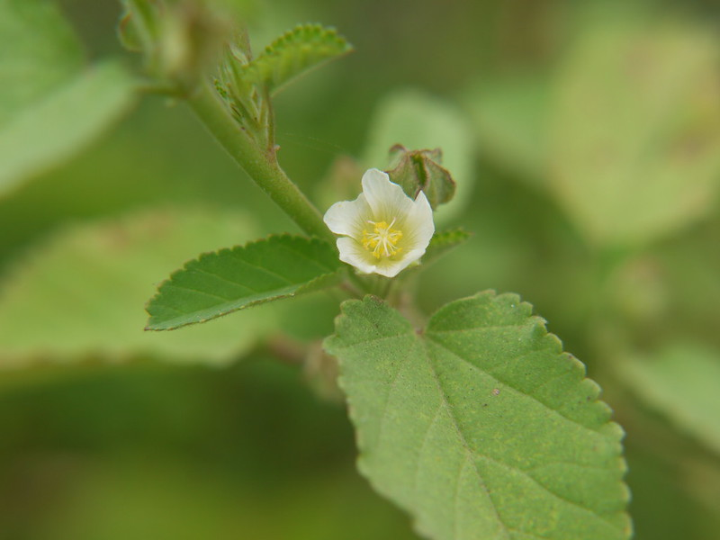

# Sida spinosa - Indian mallow, Kaadumenthya

[TOC]

**Sida spinosa** is a shrubby.
## Uses
Asthma, Chest ailments, Diarrhoea, Dysentery, Gonorrhoea, Gleet, Scalding urine, Irritate bladder.

## Parts Used
Roots, Leaves.

## Chemical Composition

## Common names
| Language | Names |
| --- | --- |
| English | Indian mallow |
| Kannada | Kaadumenthya |

## Properties
Reference: Dravya - Substance, Rasa - Taste, Guna - Qualities, Veerya - Potency, Vipaka - Post-digesion effect, Karma - Pharmacological activity, Prabhava - Therepeutics.
### Dravya
### Rasa
### Guna
### Veerya
### Vipaka
### Karma
### Prabhava
## Habit
## Identification
### Leaf
Alternate, Ovate-oblong, Crenate along the margins and sparsely cover with fine hairs

### Flower
Borne singly, 1.2cm long, Light yellow or orange petals. Flowering season is June-October

### Fruit
Fruiting season is June-October

### Other features
## List of Ayurvedic medicine in which the herb is used
## Where to get the saplings
## Mode of Propagation
## How to plant/cultivate

## Commonly seen growing in areas

## Photo Gallery

## References

## External Links
* [ ]
* [ ]
* [ ]

## References

1. [Chemistry]
2. Kappatagudda - A Repertoire of  Medicianal Plants of Gadag by Yashpal Kshirasagar and Sonal Vrishni, Page No. 342
3. [Cultivation]
4. Indian Medicinal Plants by C.P.Khare
5. **Dinesh Valke. Photograph of *Sida spinosa*. Flickr, CC BY 2.0.** [Source](https://www.flickr.com/photos/dinesh_valke/3966749930)
