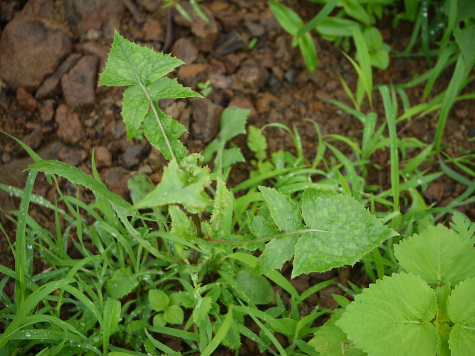

## Uses

### Food
Sonchus oleraceus can be used in Food. Leaves and tender shoots are cooked as vegetable.

## Parts Used
stem, leaves, Root.

## Chemical Composition

## Common names
## Properties
Reference: Dravya - Substance, Rasa - Taste, Guna - Qualities, Veerya - Potency, Vipaka - Post-digesion effect, Karma - Pharmacological activity, Prabhava - Therepeutics.
### Dravya
### Rasa
### Guna
### Veerya
### Vipaka
### Karma
### Prabhava
### Nutritional components
Sonchus oleraceus Contains the Following nutritional components like - Vitamin-B1, B2, B3 and C; Ursolic acid, Lupeol; Ionone, glycosides, Phenyl propanoides; Flavonoides; Calcium, Copper, Iron, Magnesium, Manganese, Phosphorus, Potassium, Sodium, Zinc

## Habit
## Identification
### Leaf

### Flower
### Fruit
### Other features
## List of Ayurvedic medicine in which the herb is used
## Where to get the saplings
## Mode of Propagation
## How to plant/cultivate
Sonchus oleraceus is available through September to May

## Commonly seen growing in areas

## Photo Gallery

## References

## External Links
* [ ]
* [ ]
* [ ]

## References

1. [Chemistry]
2. [Morphology"
3. [Cultivation]
4. Indian Medicinal Plants by C.P.Khare
5. "Forest food for Northern region of Western Ghats" by Dr. Mandar N. Datar and Dr. Anuradha S. Upadhye, Page No.140, Published by Maharashtra Association for the Cultivation of Science (MACS) Agharkar Research Institute, Gopal Ganesh Agarkar Road, Pune
6. **Dinesh Valke. Photograph of *Sonchus oleraceus*. Flickr, CC BY 2.0.** [Source](https://www.flickr.com/photos/dinesh_valke/4852120854)
