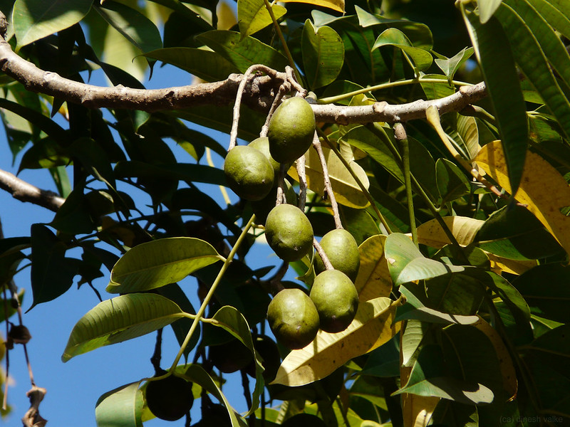

# Spondias pinnata - Wild mango

**Amrātā** consists of dried stem bark of Spondias pinnata Linn. f. Kurz. Syn. S.mangifera Willd. S. acuminata Roxb. non Gamble (Fam. Anacardiaceae) a small aromatic, deciduous tree, upto 27 m high and 2.5 m in girth, found wild or cultivated almost throughout the country and in the Andamans ascending upto an altitude of 1500 m in the Himalayas.

## Uses
Digestive complaints, Boils, Skin eruptions.

## References

1. **Daitota, P. S. Venkatarama. *Auṣadhīya Sasyagaḷu (ಔಷಧೀಯ ಸಸ್ಯಗಳು; Medicinal Plants)*. Vivekananda Samshodhana Kendra, Vivekananda Vidyavardhaka Sangha, Puttur, 2016, pp. 66-67.**
   Medicinal uses as mentioned in Daitota's Auṣadhīya Sasyagaḷu: the unripe fruit is eaten as a digestive (commonly used in regional pickle); leaves are used as a poultice for inflamed boils and skin eruptions; bark decoction is applied to chronic, psoriasis-like skin disease (karaña / sōrāyasis-spelled-out by the author). The Sanskrit synonym Āmrātaka is recorded.
2. **Dinesh Valke. Photograph of *Spondias pinnata*. Flickr, CC BY 2.0.** [Source](https://www.flickr.com/photos/dinesh_valke/3098187264)
