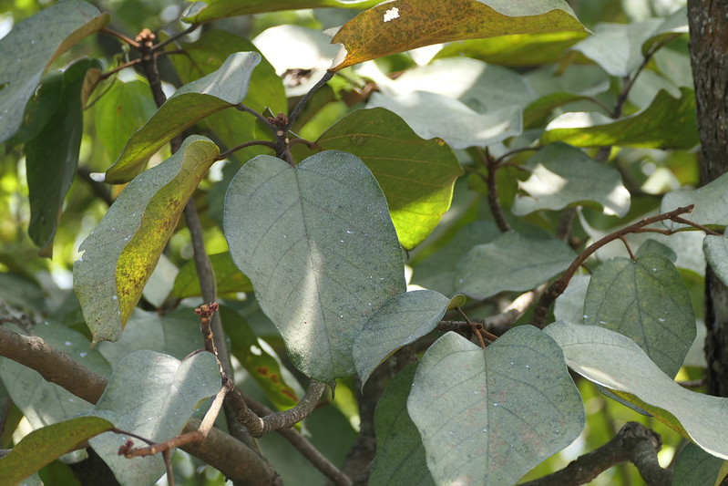

## Uses

## Parts Used
stem, leaves, Root.

### Food
Sterculia guttata can be used in Food. Tender roots and seeds are roasted and eaten . Gum is used in dairy products.

## Chemical Composition

## Common names
| Language | Names |
| --- | --- |
| English | Bloody drop ordure tree, Spotted sterculia |
| Hindi | Hirik |
| Kannada | ಹೇಲ್ ತಾರೆ Hel taare, ಹುಲಿ ತೊರಡು ಮರ Huli toradu mara |
| Malayalam | Kavalam |
| Marathi | Goldada |
| Tamil | Kalutaivitai |

## Properties
Reference: Dravya - Substance, Rasa - Taste, Guna - Qualities, Veerya - Potency, Vipaka - Post-digesion effect, Karma - Pharmacological activity, Prabhava - Therepeutics.
### Dravya
### Rasa
### Guna
### Veerya
### Vipaka
### Karma
### Prabhava
### Nutritional components
Sterculia guttata Contains the Following nutritional components like - Vitamin-A, B and C; Amino acids - Aspatic acid, Threonine, Serine, Glutamic acid, Proline, Glycine, Alanine Valine; Calcium, Copper, Iron, Magnesium, Manganese, Potassium, Sulphur, Sodium, Zinc

## Habit
## Identification
### Leaf

### Flower
### Fruit
### Other features
## List of Ayurvedic medicine in which the herb is used
## Where to get the saplings
## Mode of Propagation
## How to plant/cultivate
Sterculia guttata is available through December to May

## Commonly seen growing in areas

## Photo Gallery

## References

## External Links
* [ ]
* [ ]
* [ ]

## References

1. [Chemistry]
2. [Morphology]
3. [names](Common)(https://sites.google.com/site/indiannamesofplants/via-species/s/sterculia-guttata)
4. [Cultivation]
5. Indian Medicinal Plants by C.P.Khare
6. "Forest food for Northern region of Western Ghats" by Dr. Mandar N. Datar and Dr. Anuradha S. Upadhye, Page No.145, Published by Maharashtra Association for the Cultivation of Science (MACS) Agharkar Research Institute, Gopal Ganesh Agarkar Road, Pune
7. **Dinesh Valke. Photograph of *Sterculia guttata*. Flickr, CC BY-SA 4.0.** [Source](https://www.flickr.com/photos/dinesh_valke/55249337835)
