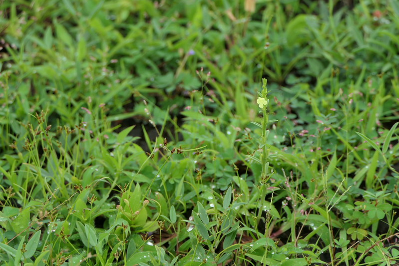

# Striga asiatica - Asiatic witchweed, Bilikasa

[TOC]

**Striga asiatica** Is a coares annual herb. It can grow up to 10-20cm in height.
## Uses
Intestinal parasites, Hematochezia, Oedema..

## Parts Used
Whole plant.

## Chemical Composition

## Common names
| Language | Names |
| --- | --- |
| English | Asiatic witchweed |
| Kannada | Bilikasa |

## Properties
Reference: Dravya - Substance, Rasa - Taste, Guna - Qualities, Veerya - Potency, Vipaka - Post-digesion effect, Karma - Pharmacological activity, Prabhava - Therepeutics.
### Dravya
### Rasa
### Guna
### Veerya
### Vipaka
### Karma
### Prabhava
## Habit
## Identification
### Leaf
Small, Linear to lanceshaped, Reduced to scales

### Flower
0.8 to 1.5cm long, Yellow, It is 2 lipped, Upper lip is 2 lobed. Flowering season is September to January

### Fruit
Capsule ovoid, Enveloped in surviving sepals. Fruiting season is September to January

### Other features
## List of Ayurvedic medicine in which the herb is used
## Where to get the saplings
## Mode of Propagation
## How to plant/cultivate

## Commonly seen growing in areas

## Photo Gallery

## References

## External Links
* [ ]
* [ ]
* [ ]

## References

1. [Chemistry]
2. Kappatagudda - A Repertoire of  Medicianal Plants of Gadag by Yashpal Kshirasagar and Sonal Vrishni, Page No. 358
3. [Cultivation]
4. Indian Medicinal Plants by C.P.Khare
5. **Dinesh Valke. Photograph of *Striga asiatica*. Flickr, CC BY 2.0.** [Source](https://www.flickr.com/photos/dinesh_valke/51384067181)
