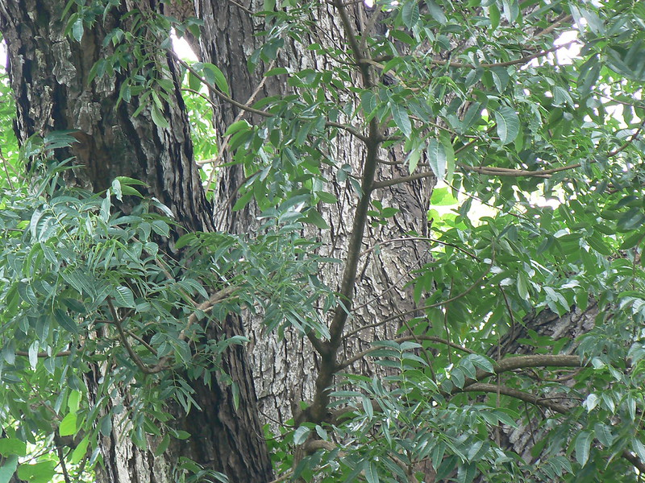

# Swietenia mahagoni

[TOC]

**Mahogany** is an evergreen or briefly deciduous tree that can grow up to 30 metres tall with a large, spherical crown and many heavy branches that cast a dense shade. The bole is often short and much-branched, up to 100cm in diameter, usually with a short, buttressing base up to 1 metre in diameter. The tree is deciduous in areas where it is subject to drought
## Uses
Diarrhoea, Dysentery, Haemorrhage, Tuberculosis, Wounds.

## Parts Used
stem, leaves, Root.

## Chemical Composition
The 1,1-diphenyl-2-picrylhydrazyl (DPPH) free radical scavenging activity of the isolated compounds indicated that all of the three compounds have strong activity compared with trolox as a reference.

## Common names
## Properties
Reference: Dravya - Substance, Rasa - Taste, Guna - Qualities, Veerya - Potency, Vipaka - Post-digesion effect, Karma - Pharmacological activity, Prabhava - Therepeutics.
### Dravya
### Rasa
### Guna
### Veerya
### Vipaka
### Karma
### Prabhava
## Habit
Evergreen tree

## Identification
### Leaf

### Flower
### Fruit
### Other features
## List of Ayurvedic medicine in which the herb is used
## Where to get the saplings
## Mode of Propagation
Seeds

## How to plant/cultivate
A plant of the moist to humid tropics, where it is found at elevations from 50 - 1,500 metres.

## Commonly seen growing in areas
Along the sides of roads.

## Photo Gallery

## References

## External Links
* [Swietenia mahagoni on indiabiodiversity.org](https://indiabiodiversity.org/species/show/246706)
* [Swietenia mahagoni on hort.ufl.edu](http://hort.ufl.edu/database/documents/pdf/tree_fact_sheets/swimaha.pdf)
* [Swietenia mahagoni on missouribotanicalgarden.org](https://www.missouribotanicalgarden.org/PlantFinder/PlantFinderDetails.aspx?taxonid=282708&isprofile=0&)

## References

1. [constituents](Chemical)(https://pubmed.ncbi.nlm.nih.gov/19266907/#:~:text=macrophylla%20together%20with%20two%20known,)%20and%20epicatechin%20(3).&text=The%201%2C1%2Ddiphenyl%2D,with%20trolox%20as%20a%20reference.)
2. [Morphology]
3. [Cultivation](http://tropical.theferns.info/viewtropical.php?id=Swietenia+mahagoni)
4. Indian Medicinal Plants by C.P.Khare
5. **Dinesh Valke. Photograph of *Swietenia mahagoni*. Flickr, CC BY 2.0.** [Source](https://www.flickr.com/photos/dinesh_valke/1126794924)
