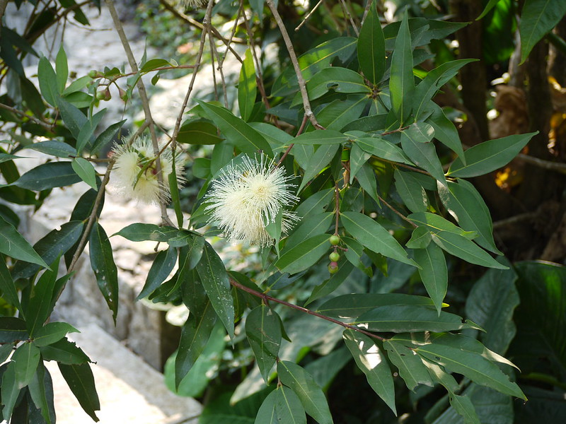

# Syzygium jambos - Rose Apple, Jambu, Gulab jamun, Perunaval, Gulabjama, Malakkachampa, Jamb

[TOC]

**Jambos** is an evergreen tree with a regular shaped, dense crown of wide-spreading branches, it can grow 6 - 10 metres tall. The bole can be 50cm in diameter, often branching from low down. A multipurpose tree that has been cultivated for around 2,500 years. It provides food, medicines and a range of commodities for the local population.
## Uses
Reduce fever, Diarrhoea, Dysentery, Catarrh, Sore eyes, Rheumatism, Smallpox, Asthma, Bronchitis, Hoarseness.

## Parts Used
Fruits, Flowers.

## Chemical Composition
It contains (E)-caryophyllene, α-humulene, α-zingibirene, hydroxytoluene butylated, caryophyllene alcohol, caryolan-8-ol, caryophyllene oxide, thujopsan-2-α-ol and n-heneicosane.

## Common names
| Language | Names |
| --- | --- |
| English | Rose Apple, Malabar plum |
| Hindi | Gulab jamun |
| Kannada | Jambu, Pannerale |
| Malayalam | Malakkachampa |
| Marathi | Jamb |
| Tamil | Perunaval |
| Telugu | Gulabjama |

## Properties
Reference: Dravya - Substance, Rasa - Taste, Guna - Qualities, Veerya - Potency, Vipaka - Post-digesion effect, Karma - Pharmacological activity, Prabhava - Therepeutics.
### Dravya
### Rasa
### Guna
### Veerya
### Vipaka
### Karma
### Prabhava
## Habit
Evergreen tree

## Identification
### Leaf

### Flower
### Fruit
### Other features
## List of Ayurvedic medicine in which the herb is used
## Where to get the saplings
## Mode of Propagation
Seeds, Air layering.

## How to plant/cultivate
Flourishes in tropical and near-tropical climates only, usually below elevations of 1,200 metres but up to 2,300 metres in Ecuador.

## Commonly seen growing in areas
Open places, Generally around villages.

## Photo Gallery

## References

## External Links
* [Syzygium jambos on cabi.org](https://www.cabi.org/isc/datasheet/52443)

## References

1. [constituents](Chemical)(https://www.scielo.br/scielo.php?pid=S0102-695X2013005000035&script=sci_arttext&tlng=en)
2. [Morphology]
3. [names](Local)(https://www.flowersofindia.net/catalog/slides/Rose%20Apple.html)
4. [Cultivation](http://tropical.theferns.info/viewtropical.php?id=Syzygium+jambos)
5. Indian Medicinal Plants by C.P.Khare
6. **Dinesh Valke. Photograph of *Syzygium jambos*. Flickr, CC BY 2.0.** [Source](https://www.flickr.com/photos/dinesh_valke/5592458879)
