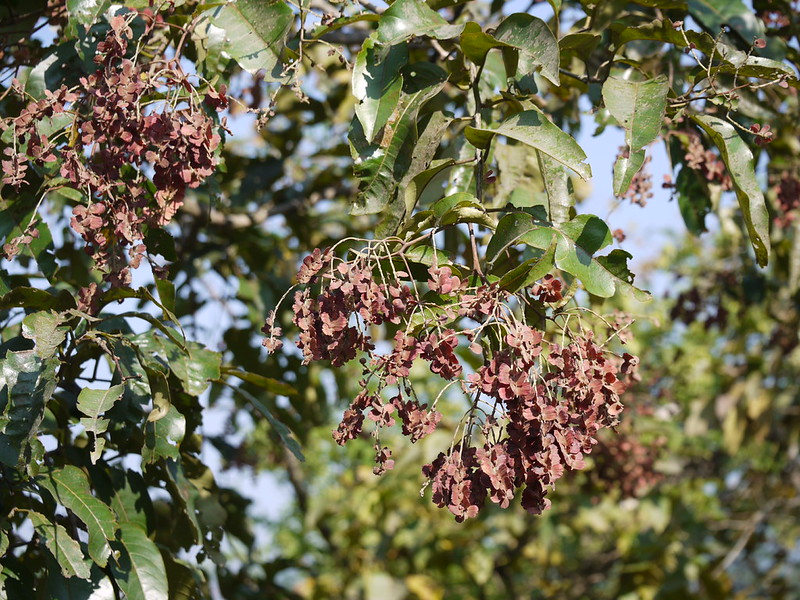

# Terminalia paniculata - Kindal Tree, ಹುಲಿವೆ, Pumarutu, Putanallamanu, Pullamaruthu, Kindal

[TOC]

**Terminalia paniculata** is a semievergreen tree growing up to 33 metres tall. The tree is harvested from the wild as a source of timber and tannins.
## Uses
Fever, Diseases of Pitta, Inflammation, Fractured bones.

## Parts Used
Bark, Heartwood.

## Chemical Composition
he phytochemical studies revealed that the presence of phenolic compounds especially alkaloids, coumarins, terpenoids etc.

## Common names
| Language | Names |
| --- | --- |
| Sanskrit | Asvakarnah |
| English | Kindal Tree, Flowering Murdah |
| Kannada | ಹುಲಿವೆ Hulive, ಹುಲುವೆ Huluve |
| Malayalam | Pullamaruthu |
| Marathi | Kindal |
| Tamil | Pumarutu |
| Telugu | Putanallamanu |

## Properties
Reference: Dravya - Substance, Rasa - Taste, Guna - Qualities, Veerya - Potency, Vipaka - Post-digesion effect, Karma - Pharmacological activity, Prabhava - Therepeutics.
### Dravya
### Rasa
### Guna
### Veerya
### Vipaka
### Karma
### Prabhava
## Habit
Semi-deciduous tree

## Identification
### Leaf

### Flower
### Fruit
### Other features
## List of Ayurvedic medicine in which the herb is used
## Where to get the saplings
## Mode of Propagation
Seeds

## How to plant/cultivate
A plant of the moist tropics. It grows best in areas where the mean maximum and minimum annual temperatures are within the range 22 - 30°c, though it can tolerate 13 - 39°c.

## Commonly seen growing in areas
Along the margins.

## Photo Gallery

## References

## External Links
* [Terminalia paniculata on ](https://sites.google.com/site/efloraofindia/species/a---l/cl/combretaceae/terminalia/terminalia-paniculata)
* [on ](http://florakarnataka.ces.iisc.ac.in/hjcb2/herbsheet.php?id=1081&cat=1)

## References

1. [constituents](Chemical)(https://www.researchgate.net/publication/297046548_Phytochemical_antioxidant_and_antimicrobial_studies_of_Terminalia_paniculata-_a_potential_medicinal_plant)
2. [Morphology]
3. [Cultivation](http://tropical.theferns.info/viewtropical.php?id=Terminalia+paniculata)
4. Indian Medicinal Plants by C.P.Khare
5. [names](Common)(https://www.flowersofindia.net/catalog/slides/Kindal%20Tree.html#:~:text=Terminalia%20paniculata%20%2D%20Kindal%20Tree&text=Kindal%20is%20a%20tropical%20tree,base%2C%20sharp%20at%20the%20tip.)
6. **Dinesh Valke. Photograph of *Terminalia paniculata*. Flickr, CC BY 2.0.** [Source](https://www.flickr.com/photos/dinesh_valke/16147941322)
