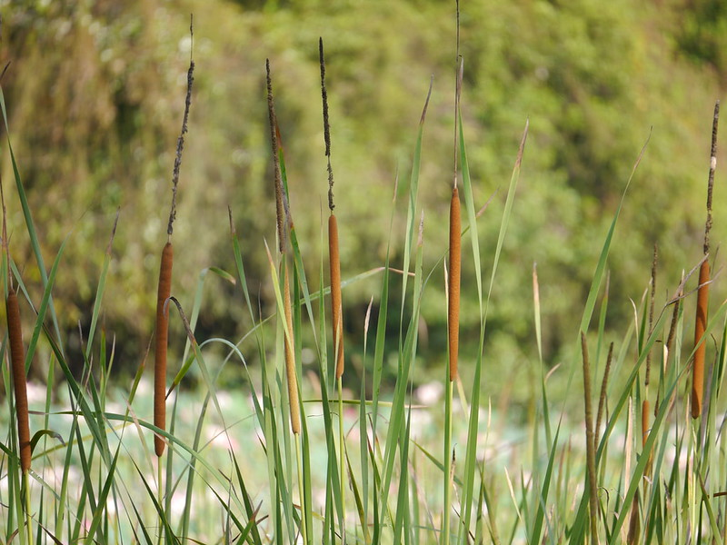

# Typha domingensis - Lesser Indian Reed-mace, Pater, Jammugaddi

[TOC]

**Gundrāḥ** consists of rhizome with root of Typha australis Schum. And Thonn. Syn. T. angustata Bory and Chaub. It is a hardy perennial, monoecious plant, often growing gregariously in fresh water and marshy places, commonly found throughout India, upto 1730 m.
## Uses
Alzheimer's disease, Nose bleeds, Haematuria, Uterine bleeding, Dysmenorrhoea, Postpartum abdominal pain, Gastralgia, Scrofula.

## Parts Used
Rizomes, Young shoots, Seeds.

## Chemical Composition
Flavonoids (Quercetin, isorhamnetin-3-0-rutinoside); sterols (β-sitosterol, lanosterol, cholesterol).

## Common names
| Language | Names |
| --- | --- |
| Sanskrit | Guṇṭaḥ, Guṇṭhaḥ |
| Telugu | Jammugaddi, Enugajamu |
| Hindi | Pater, Gondpater |
| English | Lesser Indian Reed-mace |

## Properties
Reference: Dravya - Substance, Rasa - Taste, Guna - Qualities, Veerya - Potency, Vipaka - Post-digesion effect, Karma - Pharmacological activity, Prabhava - Therepeutics.
### Dravya
### Rasa
Madhura, Kaṣāya
### Guna
Guru
### Veerya
Śīta
### Vipaka
Madhura
### Karma
Pittasaṃśamana, Vātahara, Stanyaśodhaka, Stanyajanana, śukraśodhaka, Rajośodhaka, Mūtravirecanīya, Mūtraśodhaka
### Prabhava
## Habit
Perennial

## Identification
### Leaf
Paripinnate, Oblong, Leaf Arrangementis Alternate-spiral

### Flower
Unisexual, 2-4cm long, Pink, Flowering throughout the year and In terminal and/or axillary pseudoracemes

### Fruit
Oblong pod, Thinly septate, pilose, wrinkled, Seeds upto 5, Fruiting throughout the year

### Other features
## List of Ayurvedic medicine in which the herb is used
* M£ūtravirecanīya Kaṣāya Cūrṇa, Stanyajanana Kaṣāya Cūrṇa

## Where to get the saplings
## Mode of Propagation
Seeds, Division.

## How to plant/cultivate
A plant of the warm temperate zone through to the tropics, where it is found at elevations up to 1,500 metres.

## Commonly seen growing in areas
Brackish to fresh marshes and pools.

## Photo Gallery

## References

## External Links
* [Typha australis Schum on plants.jstor.org](https://plants.jstor.org/compilation/typha.australis)
* [Typha australis Schum on flowersinisrael.com](http://www.flowersinisrael.com/Typhadomingensis_page.htm)

## References

1. The Ayuredic Pharmacopoeia of India Part-1, Volume-5, Page no-69
2. [ "Morphology"]
3. [ "Cultivation detail"]
4. **Dinesh Valke. Photograph of *Typha domingensis*. Flickr, CC BY 2.0.** [Source](https://www.flickr.com/photos/dinesh_valke/47502597372)
