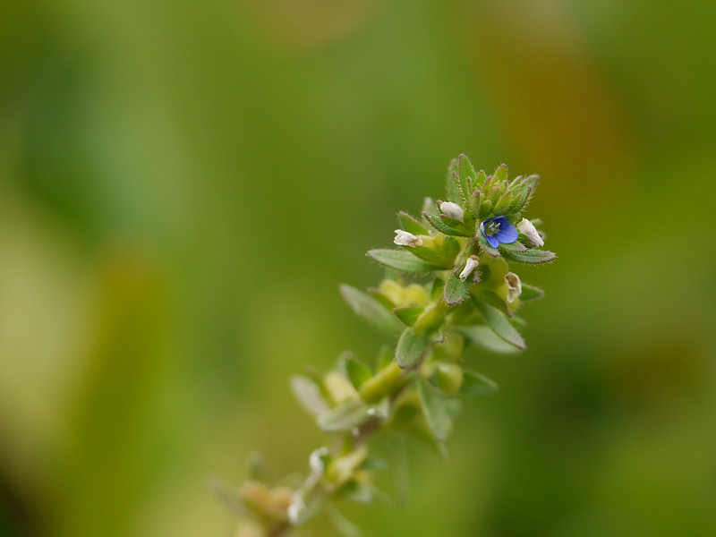

# Veronica arvensis - Wall speedwell

[TOC]

**Veronica arvensis** (common names: wall speedwell,:592 corn speedwell, common speedwell, rock speedwell, ) is an annual flowering plant in the plantain family Plantaginaceae. The species is a native European plant and a common weed in gardens, pastures, waste places and cultivated land.

## Description
It is a hairy, erect to almost recumbent, annual herb, 9 to 40 cm high from a taproot. The leaves are oppositely arranged in pairs about the stem. The lower leaves have short petioles; the upper are sessile. Each leaf, 1.5 to 2.5 centimeters in length, is ovate, or triangular with a truncated or slightly cordate base, with coarse teeth. Borne in a raceme, initially compact but elongating with age, the flowers are pale blue to blue-violet, 2 to 3 mm in diameter, four-lobed with a narrow lowest lobe. Flower stalks are 0.5 to 2 mm and shorter than the bracts. The fruit capsules are heart-shaped and shorter than the sepal-teeth. It flowers from April to October.

It is a medicinal plant. [clarification needed]

## References

## External Links
* [Veronica arvensis](https://en.wikipedia.org/wiki/Veronica_arvensis)

## References

1. [arvensis at USDA PLANTS Database](Veronica)(https://plants.usda.gov/core/profile?symbol=VEAR)
2. [arvensis at Plants For A Future](Veronica)(http://www.pfaf.org/user/Plant.aspx?LatinName=Veronica+arvensis)
3. **Dinesh Valke. Photograph of *Veronica arvensis*. Flickr, CC BY 2.0.** [Source](https://www.flickr.com/photos/dinesh_valke/6367554795)
