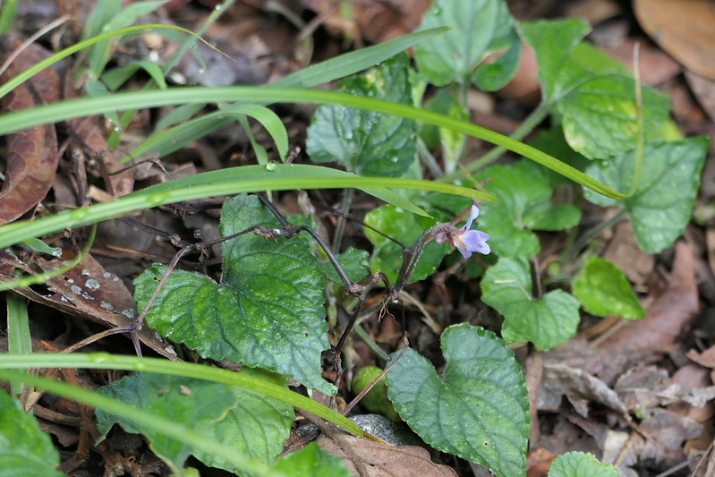

# Viola pilosa - Smooth-Leaf White Violet, Bili kaamakasthoori, Banafsha

[TOC]

**Viola pilosa** is a rather variable, herbaceous perennial plant producing a rosette of leaves and prostrate stems up to 100cm long that root at some nodes.
The plant is harvested from the wild for local use as a medicine, and possibly also as a food.
## Uses

## Parts Used
Young leaves, Flowers buds.

## Chemical Composition

## Common names
| Language | Names |
| --- | --- |
| English | Smooth-Leaf White Violet |
| Hindi | Banafsha |
| Kannada | Bili kaamakasthoori |
| KS | Banafsha |

## Properties
Reference: Dravya - Substance, Rasa - Taste, Guna - Qualities, Veerya - Potency, Vipaka - Post-digesion effect, Karma - Pharmacological activity, Prabhava - Therepeutics.
### Dravya
### Rasa
### Guna
### Veerya
### Vipaka
### Karma
### Prabhava
## Habit
Perennial

## Identification
### Leaf

### Flower
### Fruit
### Other features
## List of Ayurvedic medicine in which the herb is used
## Where to get the saplings
## Mode of Propagation
Seeds

## How to plant/cultivate
Viola pilosa has a wide native range from the warm temperate zone of southern China into the tropics of Thailand and Indonesia (where it is usually found at elevations over 1,000 metres).

## Commonly seen growing in areas
Grasslands, Alpine woods, Pathsides.

## Photo Gallery

## References

## External Links
* [Viola pilosa on flowersofindia.net](https://www.flowersofindia.net/catalog/slides/Smooth-Leaf%20White%20Violet.html)
* [Viola pilosa on indiabiodiversity.org](https://indiabiodiversity.org/species/show/262260)

## References

1. [constituents](Chemical)
2. [Morphology]
3. [Cultivation](http://tropical.theferns.info/viewtropical.php?id=Viola+pilosa)
4. Indian Medicinal Plants by C.P.Khare
5. **Dinesh Valke. Photograph of *Viola pilosa*. Flickr, CC BY-SA 4.0.** [Source](https://www.flickr.com/photos/dinesh_valke/55081600630)
